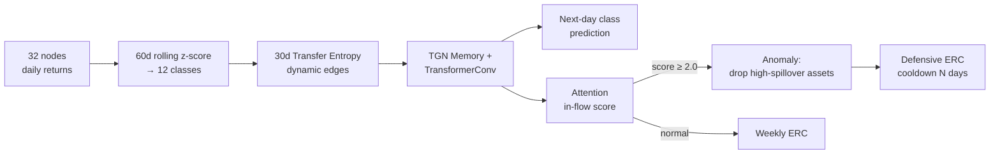

# Dynamic Portfolio Optimization Using Anomaly Detection & Risk Spillover

**Temporal Graph Network(TGN)** 로 32개 글로벌 자산·요인 간 위험 전이 네트워크를 학습하고, attention 기반 이상 신호가 발생하면 전이 위험이 큰 자산을 제외해 **Equal Risk Contribution(ERC)** 포트폴리오를 방어적으로 재구성하는 동적 자산배분 프로젝트입니다.

> Find-a 감마팀 · 12기 파이널 프로젝트


## Pipeline



## Data

32개 노드의 일별 데이터(2010–2026)를 사용합니다. 

| 그룹 | 노드 |
|---|---|
| **투자 자산 (7)** | XLK, XLF, XLV, XLY, XLE, VNQ, Gold |
| 변동성 지수 (9) | VIX, VXN, VXD, RVX, GVZ, OVX, V2TX, MOVE, JNIV |
| 해외 주가지수 (4) | STOXX50, Nikkei225, Shanghai, Hang Seng |
| 거시 (3) | DXY, 10Y rates, 5Y breakeven inflation |
| 원자재 (9) | WTI, NatGas, Silver, Copper, Corn, Wheat, Soybean, Coffee, Cotton |

**타깃**: 일별 로그수익률을 60일 rolling z-score로 표준화한 뒤 $\lfloor z \rfloor$를 $[-6, 5]$로 잘라 12개 클래스로 만듭니다. 클래스 6 이상($z \ge 0$)을 상승으로 봅니다.

## Model

- **동적 그래프**: 매일 최근 30일 z-score를 3구간으로 이산화하고, 노드 쌍의 transfer entropy가 임계값 이상이면 방향성 엣지를 생성합니다. 엣지 특성은 `[source 수익률, TE]`입니다.
- **TGN**: `TGNMemory`(memory 100, time 100) → `TransformerConv`(2 heads, 상대 시간 인코딩을 엣지 특성에 더함) → MLP로 다음 날 12-클래스를 예측합니다.
- **모드**: `core`(투자 자산 7개 예측), `others`(요인 25개 예측), `all`(전체)

## Results

### 1. 예측 성능 (Walk-forward, 4y train / 1y val / 1y test)

Step 1–3 평균, 단위 %. 완벽 = 12-클래스 정확도, 방향 = 상승/하락 정확도입니다.

| Model | CORE 완벽 | CORE 방향 | OTHERS 완벽 | OTHERS 방향 |
|---|---:|---:|---:|---:|
| **TGN** | 36.82 | **51.66** | **41.41** | **59.23** |
| LSTM | 36.06 | 50.42 | 39.22 | 55.67 |
| TCN | **36.86** | 51.00 | 38.25 | 55.43 |
| Transformer | 36.47 | 50.45 | 38.13 | 54.44 |

TGN은 요인 노드(OTHERS) 예측에서 모든 baseline보다 완벽 적중률 약 2–3%p, 방향 적중률 약 3.5–5%p 높습니다. 투자 자산(CORE)에서는 baseline과 비슷한 수준입니다.

Step 1–2의 테스트 구간은 모든 모델에서 같습니다. Step 3은 TGN이 2017-04 ~ 2018-03, baseline이 2017-04 ~ 2017-12입니다.

### 2. 백테스트 (2018-01 ~ 2026-05, 1억 원, 편도 10bp)

최종 TGN 모델은 2010–2016 학습, 2017 검증 데이터만 사용했습니다.

| Strategy | 최종자산 | CAGR | Vol | Sharpe | MDD | 연 Turnover |
|---|---:|---:|---:|---:|---:|---:|
| **TGN attention 2.0 + weekly ERC** | **2.43억** | **11.36%** | 14.07% | **0.83** | **−27.45%** | 1.6 |
| + Miss-2 rule (best of cooldown 10/20/30d) | 0.54억 | −7.23% | 16.95% | −0.36 | −50.48% | 102.4 |
| + Miss-5 rule (best of cooldown 10/20/30d) | 0.84억 | −2.08% | 17.85% | −0.03 | −42.39% | 67.0 |

"방향 예측 n일 연속 실패" 규칙(Miss-n)을 추가하면 성과가 크게 나빠집니다. 32개 노드 중 하나라도 연속으로 틀리면 이상으로 판정되는데, 방향 적중률이 50%대라 이 조건이 거의 매일 충족됩니다. 그 결과 방어 모드가 상시 유지되고 회전율이 40배 이상 늘었습니다.


```bash
pip install -r requirements.txt
```

## Limitations

- 03(최종 학습), 04, 07(백테스트)의 `transfer_entropy` 함수는 정보이론적 TE가 아닙니다. lag-1 이산 상태 일치 비율을 쓰는 간이 지표이고, 임계값 0.001에서는 거의 모든 노드 쌍에 엣지가 생깁니다. 01의 walk-forward 평가는 `pyinform`의 TE를 사용합니다.
- 12-클래스 분포가 중앙 클래스에 몰려 있어, 완벽 적중률은 최빈 클래스 예측 기준과 함께 해석해야 합니다.
- 백테스트의 attention 임계값(2.0)과 cooldown은 테스트 구간 결과를 보고 고른 값입니다.
